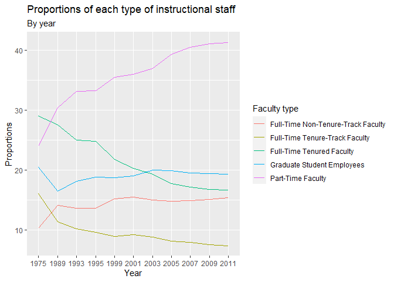
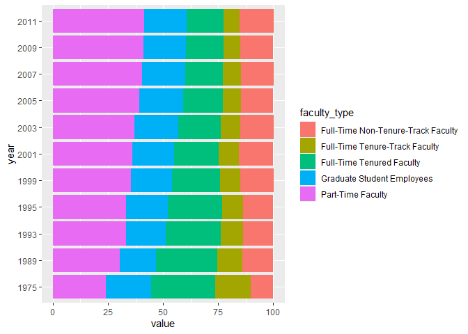

Lab 06a - Sad plots
================
Fanyi Zeng
03/01/22

### Load packages and data

``` r
library(tidyverse) 
library(dsbox) 
```

Let’s start by loading the data used to create this plot.

``` r
staff <- read_csv("data/instructional-staff.csv")
```

In order to recreate this visualization we need to first reshape the
data to have one variable for faculty type and one variable for year. In
other words, we will convert the data from wide format to long format.

``` r
staff_long <- staff %>%
  pivot_longer(cols = -faculty_type, names_to = "year") %>%
  mutate(value = as.numeric(value))
```

And now let’s plot it as a line plot. A possible approach for creating a
line plot where we color the lines by faculty type is the following:

``` r
staff_long %>%
  ggplot(aes(x = year, y = value, group = faculty_type, color = faculty_type)) +
  geom_line() +
  labs(title = "Proportions of each type of instructional staff", subtitle = "By year", x = "Year", y = "Proportions", color = "Faculty type")
```

<!-- -->

I think the plot above already shows that the proportion of part-time
faculty have gone up over time compared to other instructional staff
types, but we can use a stack chart to make that clearer.

``` r
staff_long %>%
  ggplot(aes(y=year,x = value, fill=faculty_type)) +
  geom_col()
```

<!-- -->
